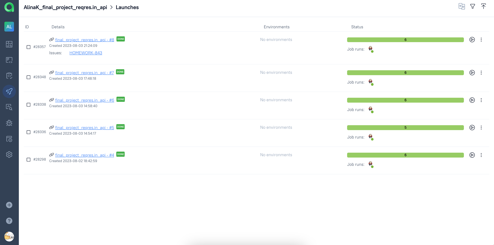

# Дипломный проект по API-тестированию cайта [Reqres.in](https://reqres.in/)

## Содержание:

* <a href="#annotation">Описание</a>
* <a href="#tools">Технологии и инструменты</a>
* <a href="#cases">Тест кейсы</a>
* <a href="#console">Запуск тестов из терминала</a>
* <a href="#jenkins">Запуск тестов в Jenkins</a>
* <a href="#allure">Отчеты в Allure</a>
* <a href="#testops">Интеграция с Allure TestOps</a>
* <a href="#jira">Интеграция с Jira</a>
* <a href="#telegram">Уведомления в Telegram с использованием бота</a>

<a id="annotation"></a>
## Описание
Тестовый проект состоит из API-тестов.

Краткий список интересных фактов о проекте:
- [x] Возможность локального и удалённого запуска тестов
- [x] Возможность запуска как всех тестов, так и отдельно по каждому определенному тегу
- [x] Использование `Lombok` для моделей в API тестах
- [x] Использование request/response спецификаций для API тестов
- [x] Custom Allure listener для API requests/responses логов
- [x] Интеграция с `Allure TestOps`
- [x] Возможность запуска тестов напрямую из `Allure TestOps`
- [x] Интеграция с `Jira`
- [x] Автотесты оформлены как тестовая документация посредством аннотаций `Allure`

<a id="tools"></a>
## Технологии и инструменты

<div align="center">
<a href="https://www.jetbrains.com/idea/"></a>
<a href="https://github.com/"></a>  
<a href="https://www.java.com/"></a>
<a href="https://gradle.org/"></a>  
<a href="https://junit.org/junit5/"></a>
<a href="https://rest-assured.io/"></a>
<a href="https://projectlombok.org/"></a>
<a href="https://www.jenkins.io/"></a>
<a href="https://github.com/allure-framework/"></a>
<a href="https://qameta.io/"></a>
<a href="https://www.atlassian.com/software/jira"></a>  
<a href="https://telegram.org/"></a>
</div>

<code>Java</code> - основной язык проекта.\
<code>REST Assured</code> — для тестирования REST-API сервисов.\
<code>Lombok</code> — библиотека для сокращения кода в классах.\
<code>Gradle</code> — используется как инструмент автоматизации сборки.\
<code>JUnit5</code> — фреймворк модульного тестирования для выполнения тестов.\
<code>Jenkins</code> — CI/CD для запуска тестов удаленно.\
<code>Allure Report</code> — для визуализации результатов тестирования.\
<code>Allure TestOps</code> — как система управления тестированием.\
<code>Telegram Bot</code> — для уведомлений о результатах тестирования.\
<code>Jira</code> — как инструмент управления проектом и таск-трекер.

**Allure Report**, **AllureTestOps** и **Telegram Bot** используются для визуализации результатов тестирования.

Allure-отчет включает в себя:
* Информацию reqest-е запроса
* Информацию о response ответа

<a id="cases"></a>
## Тест кейсы

Проект содержит следующие автоматизированные кейсы:
- Получение списка пользователей
- Получение информации о пользователе
- Получение информации о несуществующем пользователе
- Редактирование пользователя
- Удаление пользователя
- Создание нового пользователя с валидными данными

<a id="console"></a>
##  Запуск тестов из терминала
### Локальный запуск тестов
Все тесты запустятся локально на вашей машине:
```bash
gradle clean test
```

<a id="jenkins"></a>
## Запуск тестов в [Jenkins](https://jenkins.autotests.cloud/job/final_project_reqres.in_api/)
Сборка с параметрами позволяет перед запуском изменить параметры для сборки (путем выбора из списка или прямым указанием значения).
<p align="center">
  
</p>

После выполнения сборки в блоке <code>История сборок</code> напротив номера сборки появится
значки *Allure Report* и *Allure TestOps*, клик по которым позволит ознакомиться с более детальными отчетами о пройденных тестах.

<a id="allure"></a>
## Отчет в [Allure Report](https://jenkins.autotests.cloud/job/final_project_reqres.in_api/8/allure/)
### Основной дашборд
<p align="center">
  
</p>

### Тесты
<p align="center">
  
</p>

### Графики
<p align="center">
  
</p>

<a id="testops"></a>
##  Интеграция с [Allure TestOps](https://allure.autotests.cloud/launch/28349)

### Основной дашборд

<p align="center">
  
</p>

### Автоматизированные тест-кейсы

<p align="center">
  
</p>

### Запуски сборок

<p align="center">
  
</p>

<a id="jira"></a>
## Интеграция с <a target="_blank" href="https://jira.autotests.cloud/browse/HOMEWORK-843"> Jira </a>
<p align="center">

</p>

<a id="telegram"></a>
## Уведомления в Telegram с использованием бота
<p align="center">

</p>
